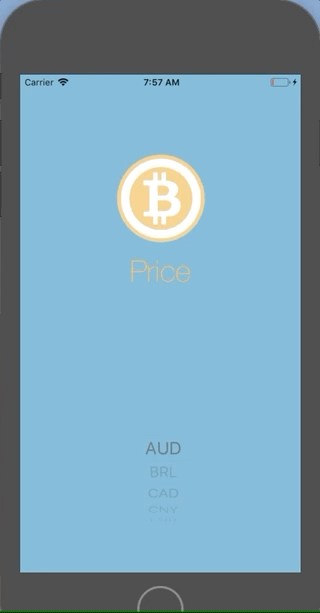

# BitcoinPrice

## Overview 
App shows current price of bitcoin in different currencies

### Implemented bits
* use autlayout to provide both landscape and portrait mode
* use of UIPickerView, Implementing delegate and data source methods
* use Alamofire for data fetching
* use SwiftyJSON for data Parsing

